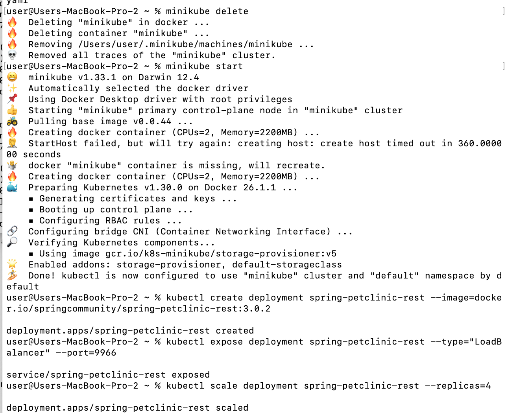

# Tutorial 11 (Minikube)
Nama: Sheryl Ivana Widjaja<br>
NPM: 2206824943<br>
Kelas: Pemrograman Lanjut - A<br>

---
## REFLEKSI 1
###### 1.1. Compare the application logs before and after you exposed it as a Service. Try to open the app several times while the proxy into the Service is running. What do you see in the logs? Does the number of logs increase each time you open the app?
 
Yes, there is a difference because after the service is exposed. The service can receive requests so that the log will record requests that have been made, for example as follows if refreshed many times against the hello-node service

###### 1.2. Notice that there are two versions of `kubectl get` invocation during this tutorial section. The first does not have any option, while the latter has `-n` option with value set to `kube-system`. What is the purpose of the `-n` option and why did the output not list the pods/services that you explicitly created?
The -n option indicates that the service we want is from the namespace, which is how the two syntaxes differ from one another. This is necessary, for instance, if numerous services with the same name are dispersed among numerous namespaces. By utilizing -n, we direct the get to the namespace we provide following the -n query.  
<br>

# Rolling Update & Kubernetes Manifest File  
1. What is the difference between Rolling Update and Recreate deployment strategy?  
Recreate deployment requires uninstalling the old application and then redeploying the new one, therefore there will be a lag between updates. This is the primary distinction between recreate deployment and rolling update method. As a result, after the deletion and deployment are finished, there will be a pause. as opposed to rolling updates, which gradually upgrade the program to the most recent version.  


## REFLEKSI 2 (Rolling Update & Kubernetes Manifest File)
###### 2.1. What is the difference between Rolling Update and Recreate deployment strategy?
*The main difference between rolling update strategy and recreate deployment is that in recreate deployment there will be downtime between application updates because this strategy requires first deleting the previous application and then redeploying the new application. Therefore, there will be downtime after deletion and completion of deployment. Compared to rolling updates that change the application slowly to its latest version.
<br>

###### 2.2. Try deploying the Spring Petclinic REST using Recreate deployment strategy and document your attempt.
* Dibuatnya ulang `springboot-petclinic-rest` yang sudah di *scale* versi 3.0.2
 
* Lalu, sifat dari ReplicaSet akan dimanfaatkan untuk menggantikan pod yang terhapus dengan template-nya. Template tersebut kemudian akan diperbarui ke versi yang baru sesuai dengan pengaturan berikutnya.
 
* Kemudian, periksalah keberhasilan perubahan query yang menghasilkan output seperti di gambar.
 

* Setelah itu, kita delete pod.

* Dapat dilihat bahwa pod-pod yang baru sedang dibuat untuk menggantikan yang lama.

* Kemudian, run dan muncul seperti gambar di bawah ini.

* Terakhir, berhasil. 


<br>

3. Prepare different manifest files for executing Recreate deployment strategy.  
    A file can be created as attached in github with the name deployment2.yaml. The contents of the file are the same as the export file in the tutorial but there are differences in the sections.  
    ```yaml
        selector:
            matchLabels:
            app: spring-petclinic-rest
        strategy:
            type: Recreate
    ```
    The file can be imported into Kubernetes like any other manifest file, then after that to prove that this manifest file is useful, we can change the image in the file to the version we want where it will delete pods in our old replica sets and then deploy new pods in new replicasets as shown below.  
      

So it is evident that updates are done in a recreate strategy and not rolling.  
4. What do you think are the benefits of using Kubernetes manifest files?  
    Manifest files have the obvious benefit of being efficient. The steps and syntax required to complete the initial update or deployment no longer need to be remembered. It functions similarly to file imports in Documents. The fact that the document is now usable is all that matters; we don't need to know how it got that way. Additionally, it implies that we lower the chance of human error because the manifest file ensures that the service is formed in compliance with its contents and prevents mistakes from programmers when entering syntax one letter at a time.  